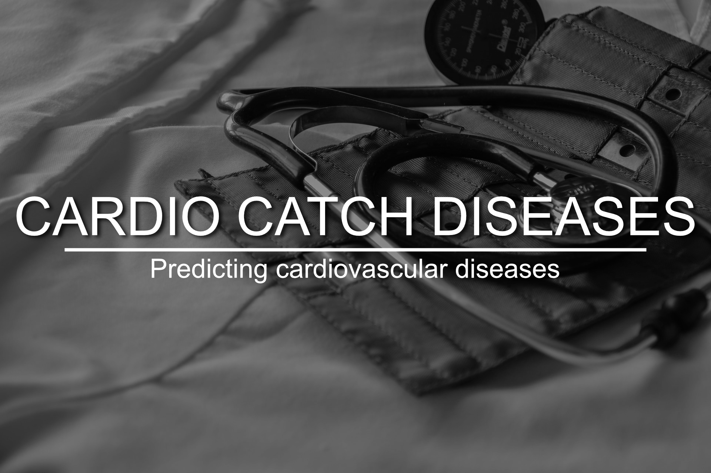
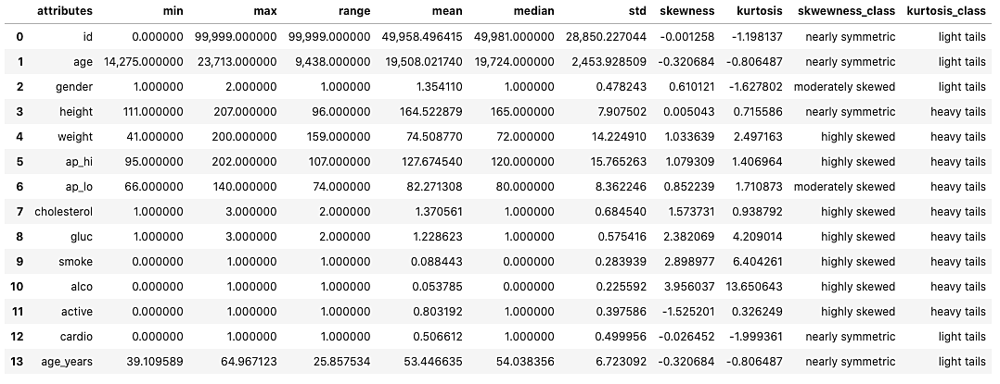
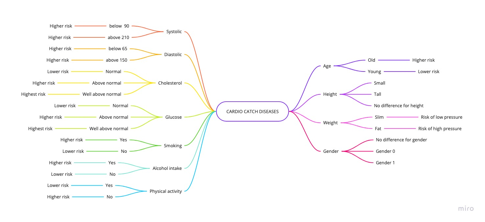
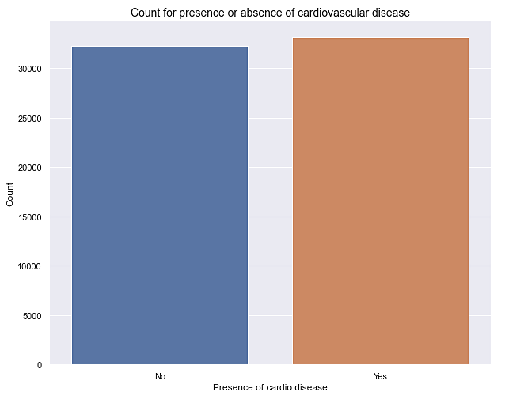
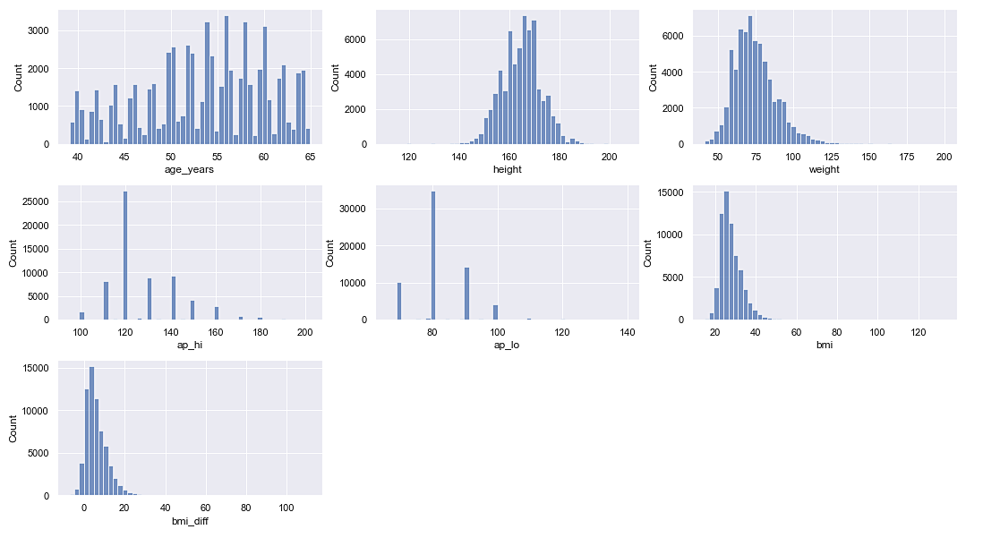
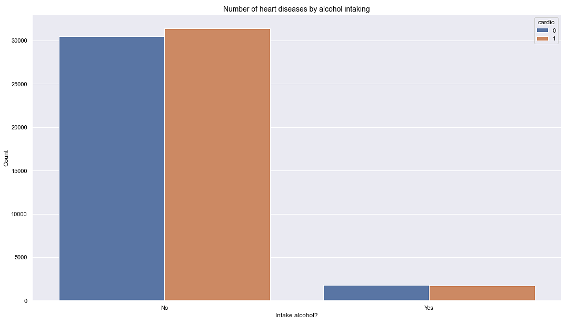

# Cardio Catch Diseases (CCD)
## Predicting cardiovascular diseases

Photo by <a href="https://unsplash.com/@marceloleal80?utm_source=unsplash&amp;utm_medium=referral&amp;utm_content=creditCopyText">Marcelo Leal</a> on <a href="https://unsplash.com/collections/79204339/healthcare?utm_source=unsplash&amp;utm_medium=referral&amp;utm_content=creditCopyText">Unsplash</a>

# 1.0 The context

## 1.1 What are Cardiovascular Diseases (CVDs)?

Cardiovascular disease can refer to a number of conditions:

- Heart disease
- Heart attack
- Stroke
- Heart failure
- Arrhythmia
- Heart valve problems

## 1.2 Key Facts (as May/2017)

- **CVDs are the number 1 cause of death globally**: more people die annually from CVDs than from any other cause.
- An estimated **17.9 million** people died from CVDs in 2016, representing 31% of all global deaths. Of these deaths, 85% are due to heart attack and stroke.
- Over three quarters of CVD deaths take place in **low- and middle-income countries**.
- Out of the **17 million** premature deaths (under the age of 70) due to noncommunicable diseases in 2015, **82%** are in low- and middle-income countries, and 37% are caused by CVDs.
- Most cardiovascular diseases can be **prevented by addressing behavioural risk factors** such as tobacco use, unhealthy diet and obesity, physical inactivity and harmful use of alcohol using population-wide strategies.
- People with cardiovascular disease or who are at high cardiovascular risk (due to the presence of one or more risk factors such as hypertension, diabetes, hyperlipidaemia or already established disease) **need early detection and management** using counselling and medicines, as appropriate.

PS 1: All the references are stated at the end of this README.

PS 2: You can find useful information at **section 1** of my [notebook](https://github.com/brunokatekawa/cardio_catch_diseases/blob/main/pa001_cardio_catch_diseases_bruno_katekawa_c03.ipynb).

 

# 2.0 The challenges

Cardio Catch Diseases is a company specialized in detecting heart disease in the early stages. Its business model lies in offering an early diagnosis of cardiovascular disease for a certain price.

Currently, the diagnosis of cardiovascular disease is manually made by a team of specialists. The current accuracy of the diagnosis varies between 55% and 65%, due to the complexity of the diagnosis and also the fatigue of the team who take turns to minimize the risks. The cost of each diagnosis, including the devices and the payroll of the analysts, is around $1,000.00.

The price of the diagnosis, paid by the client, varies according to the precision achieved by the team of specialists.

| Exam Accuracy | Price          | Rules                                    | Example                         |
|:--------------|:---------------|:-----------------------------------------|:--------------------------------|
| Above 50%     | min \$500\.00  | \+\$500 for each additional 5% precision | Precision = 55% \-> \$1,000\.00 |
| Up to 50%     | $0\.00         | N/A                                      | N/A                             |

Thus, we see that **different values in the exam precision**, given by the team of specialists, make the company either have a profitable operation, revenue greater than the cost, or an operation with a loss, revenue less than the cost. This instability of the diagnosis makes the company to have an **unpredictable cashflow**.

 

# 3.0 The solution

In this project, I managed to address the challenge by developing a classification model that can be deployed to Cardio Catch Diseases Lab. The model has a **precision** that ranges from **74.54% to 76.6%** and can help specialists in cardiovascular diseases to give a second opinion for the patients.

 

## 3.1 What drove the solution

### 3.1.1 Exploratory Data Analysis

#### Descriptive Analysis

Key points:

- The **youngest person** is 39 years old.
- The **oldest person** is 65 years old.
- The **shortest person** is 111 cm tall.
- The **tallest person** is 207 cm tall.
- The **thinnest person** weights 41 kg.
- The **fatest person** weights 200 kg.
- There are people presenting **hypertension and high blood pressure**.

 

#### Hypothesis Map

This map to help us to decide which variables we need in order to validate the hypotheses.

#### Univariate Analysis - Target

Number of presence of CVDs: 33,137 (0.51% of the total cases)

Number of absence of CVDs: 32,272 (0.49% of the total cases)

 

#### Univariate Analysis - Numerical

As observed, most examined patients:

- Have ages between 50 and 60 years old.
- Are 160 cm to 170 cm tall.
- Weight between 60 kg to 80 kg.
- Presents a blood pressure of 120 for diastolic and 80 for systolic which means elevated to high blood pressure.

 

#### Univariate Analysis - Categorical

 

### 3.1.2 Hypothesis validation - Bivariate Analysis

#### Main Hypothesis

#### H2. The cases of heart diseases does not significantly depend on the height. (FALSE)

As observed, up to ~165 cm there are significantly more cases of heart diseases. Then, above this height, there are fewer cases.

> Thus, the hypothesis is **FALSE**.

### H7. The are more cases of heart diseases for people who smokes than for people who does not. (FALSE)

As observed, the great majority of cases are among people who doesn't smoke.

> Thus, the hypothesis is **FALSE**.

### H8. The are more cases of heart diseases for people who intakes alcohol than for people who does not. (FALSE)

As observed, the great majority of cases are among people who doesn't intake alcohol.

> Thus, the hypothesis is **FALSE**.

### H9. The are more cases of heart diseases for people who does not do any physical activity than for people who does. (TRUE)

As observed, people who don't do any physical activity presents more cases of heart diseases.

> Thus, ths hypothesis is **TRUE**.

 

#### Hypothesis summary

| ID  | Description                                                                                                    | Conclusion                                                                     |
|-----|----------------------------------------------------------------------------------------------------------------|--------------------------------------------------------------------------------|
| H1  | There are less cases of heart diseases among young people \(up to 30s\)                                        | TRUE                                                                           |
| H2  | The cases of heart diseases does not significantly depend on the height                                        | FALSE                                                                          |
| H3  | The higher the weight, the higher is the cases of heart diseases                                               | TRUE                                                                           |
| H4  | The cases of heart diseases does not significantly depend on the gender                                        | FALSE                                                                          |
| H5  | There are more cases of heart diseases for people presenting well above normal levels of cholesterol           | TRUE                                                                           |
| H6  | There are more cases of heart diseases for people presenting well above normal levels of glucose               | TRUE                                                                           |
| H7  | The are more cases of heart diseases for people who smokes than for people who does not                        | FALSE                                                                          |
| H8  | The are more cases of heart diseases for people who intakes alcohol than for people who does not               | FALSE                                                                          |
| H9  | The are more cases of heart diseases for people who does not do any physical activity than for people who does | TRUE                                                                           |
| H10 | How are the cases of heart diseases distributed among systolic blood pressures?                                | As observed, there are more cases for people that presents high blood pressure |
| H11 | How are the cases of heart diseases distributed among diastolic blood pressures                                | As observed, there are more cases for people that presents high blood pressure |

 

### 3.1.3 Machine Learning

Tests were made using different algorithms.

#### Performance Metrics

The <mark>**highlighted cells**</mark> correspond to the max value at each column.

As observed, for the context of our project, we are:

- On the **business** side, aiming for precision, as each 5% more on precision translates to \$500 more from each diagnostic made.
- On the **patient** side, aiming for recall, as we are trying to minimize the false negative rate.

In addition, we're trying to reach a **balance between precision and recall**. We can make use of **f1-score** as a metric that can provide us this balance. Thus, the algorithm that satisfies this need is `LGBMClassifier`.

#### Confusion Matrices

Although, `SGDClassifier` has the highest precision and `RandomForestClassifier` has the highest recall, we're aiming for highest `f1-score`. In addition, `RandomForestClassifier` has one of the highest FP (2594)  while `SGDClassifier` has one of the highest FN (2618) which is not appropriate. Thus, we're moving on with `LGBMClassifier`.

 

### 3.1.4 Business Performance

Let's recap the pricing model. The price of the diagnosis, paid by the client, varies according to the precision achieved by the team of specialists.

| Exam Accuracy | Price          | Rules                                    | Example                         |
|:--------------|:---------------|:-----------------------------------------|:--------------------------------|
| Above 50%     | min \$500\.00  | \+\$500 for each additional 5% precision | Precision = 55% \-> \$1,000\.00 |
| Up to 50%     | $0\.00         | N/A                                      | N/A                             |

Our full original data set contains the records of 70,000 patients. Suppose we were to make them go through the clinic procedure to check if they have a cardiovascular disease, our model have reached a **precision** that ranges **from 74.54% to 76.6%**, which is higher than the 55% to 65% that we have on today's procedures. Thus, translating it to business numbers.

|                        | Best              | Worst             |
|:-----------------------|------------------:|------------------:|
| Our model (TO BE)      | \$186,164,981.89  | \$171,777,607.99  |
| Today (AS IS)          | \$105,000,000.00  | \$35,000,000.00   |

This means that having a portfolio of 70k patients that would go through the clinical procedure to check whether they have or not a cardiovascular disease, in the **worst business scenario** the portfolio would generate a profit of **\$171.7 million** and in the **best scenario \$186.2 million**, in contrast to today's procedure that at its best has an accuracy of 65% and would generate a total of \$105 million, that's **a difference of \$81.2 million!**

 

### 3.1.5 Machine Learning Performance for the chosen algorithm

The chosen algorithm was the **CatBoost Classifier**. In addition, I made a performance calibration on it.

#### Precision, Recall, ROC AUC and other metrics

These are the metrics obtained from the test set.

| precision | recall  | f1\-score | roc auc | cohen kappa | accuracy |
|-----------|---------|-----------|---------|-------------|----------|
| 0\.7350   | 0\.7313 | 0\.7331   | 0\.7951 | 0\.4605     | 0\.7303  |

 

The summary below shows the metrics comparison after running a cross validation score with stratified K-Fold with 10 splits in the full data set.

|                                            | Avg Precision             | Avg Recall                | Avg f1\-score             | Avg ROC AUC               |
|--------------------------------------------|---------------------------|---------------------------|---------------------------|---------------------------|
| LGBM Classifier                            | 0\.7535 \(\+/\- 0\.0087\) | 0\.7021 \(\+/\- 0\.0117\) | 0\.7269 \(\+/\- 0\.0095\) | 0\.7977 \(\+/\- 0\.0090\) |
| LGBM Classifier \(Tuned HP\)               | 0\.7522 \(\+/\- 0\.0080\) | 0\.7039 \(\+/\- 0\.0144\) | 0\.7272 \(\+/\- 0\.0092\) | 0\.7967 \(\+/\- 0\.0076\) |
| LGBM Classifier \(Tuned HP \+ Calibrated\) | 0\.7557 \(\+/\- 0\.0103\) | 0\.7002 \(\+/\- 0\.0163\) | 0\.7269 \(\+/\- 0\.0097\) | 0\.7974 \(\+/\- 0\.0078\) |

Although the **Tuned HP + Calibrated** model has a slightly lower f1-score and recall, it has a higher precision which is fair enough for our project needs. In addition, for being calibrated, in the future predictions it will be more stable and confident which is good for both business and patients.

 

# 4.0 Next Steps

**4.1** **Develop an app** that intakes a portfolio of patients and assigns for each patient its respective probability of presenting a cardiovascular disease.

**4.2** **Run a Design Discovery** to uncover facts that could be missing in our analysis in order to enrich the data that we have and improve the model performance.

**4.3** Build a **model retraining pipeline**.

 

# References

### Context
- https://www.heart.org/en/health-topics/consumer-healthcare/what-is-cardiovascular-disease
- https://www.who.int/news-room/fact-sheets/detail/cardiovascular-diseases-(cvds)

### Business problem
- https://sejaumdatascientist.com/projeto-de-data-science-diagnostico-precoce-de-doencas-cardiovasculares/

### Supplementary Materials
- https://www.thelancet.com/journals/langlo/article/PIIS2214-109X(19)30318-3/fulltext